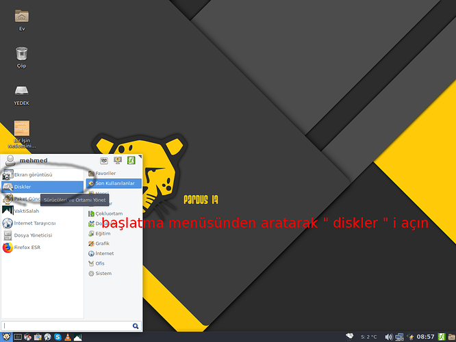
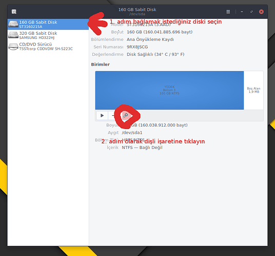
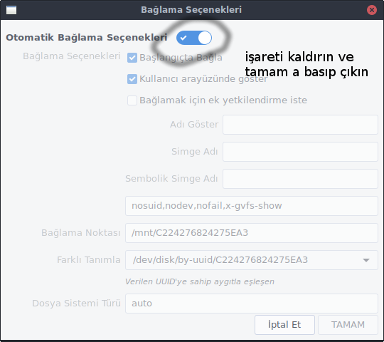

# Diskin Açılışta Otomatik Bağlanması

* [x] Başlama menüsünü açıp `Diskler` aratalım ve açalım.

<figure><figcaption></figcaption></figure>

* [x] Açılan menüden başlangıçta bağlanmasını istediğimiz diski seçelim ve `ek bölümleme seçenekleri` kısmına tıklayalım. aşağı açılır sekmeden `bağlama seçeneklerini düzenle` yi seçelim.

<figure><figcaption></figcaption></figure>

* [x] Açılan penceredeki onayı kaldırıp şifremizi girelim ve onaylayıp kapatalım.

<figure><figcaption></figcaption></figure>

> [Kaynak](https://forum.pardus.org.tr/t/diskin-acilista-otomatik-baglanmasi/10344/3)
