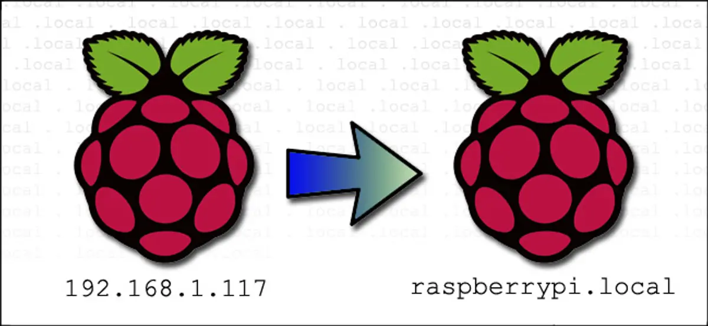
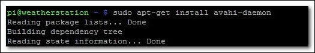
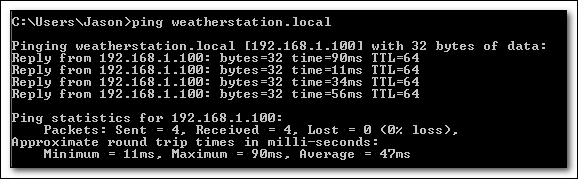

# Raspberry Pi'nize .local Etki Alanı Nasıl Atanır?

<figure><figcaption></figcaption></figure>

<figure><figcaption></figcaption></figure>

<figure><figcaption></figcaption></figure>

> [Kaynak](https://www.howtogeek.com/167190/how-and-why-to-assign-the-.local-domain-to-your-raspberry-pi/)
