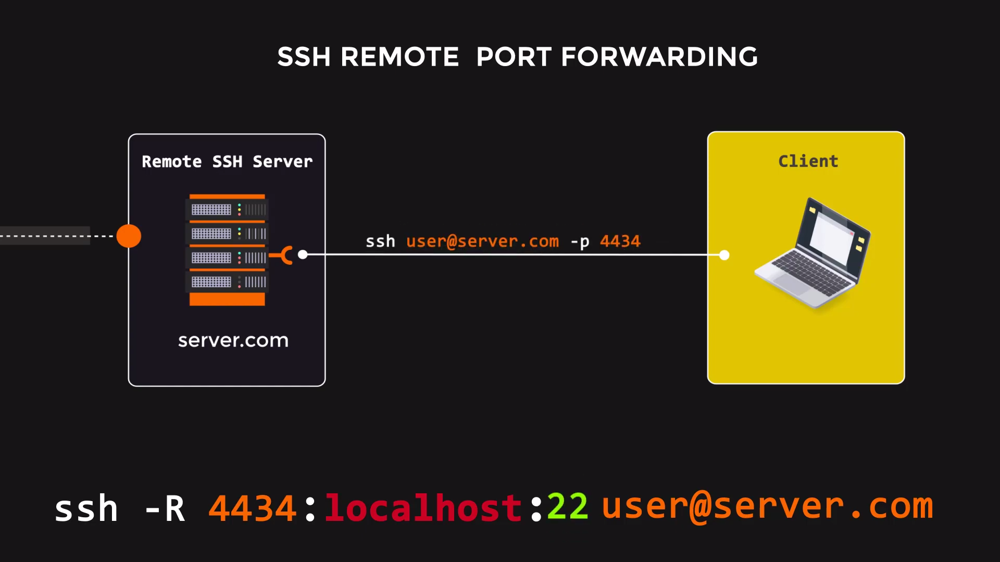

# Faydalı Araçlar

## :whale2: Docker


****[**portainer/portainer-ce**](https://hub.docker.com/r/portainer/portainer-ce)****



****[**jc21/nginx-proxy-manager**](https://hub.docker.com/r/jc21/nginx-proxy-manager)****



****[**mailcow: dockerized**](https://github.com/mailcow/mailcow-dockerized)****

**»** [_Mailcow: Setting up a full featured self hosted mail server_](https://dev.to/hatembentayeb/mailcow-setting-up-a-full-featured-self-hosted-mail-server-4511)__



****[**cosimoscarcella/wordpress-installer**](https://github.com/cosimoscarcella/wordpress-installer)


## :computer: SSH Uzaktan Port Yönlendirme

<figure><figcaption>
<a href="https://youtu.be/Y2v8Hn11H-s">SSH Remote Port Forwarding - Animated Explainer Video</a>
</figcaption></figure>

> uzak sunucuda `/etc/ssh/sshd_config` dosyasına
>
> `GatewayPorts yes`
>
> eklenmesi yeterli
